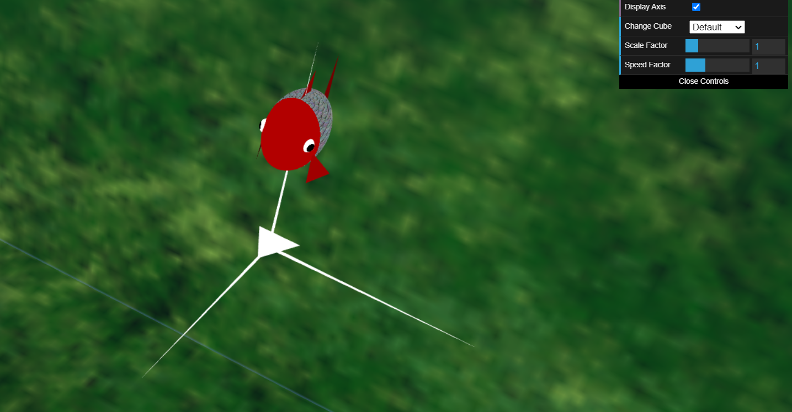
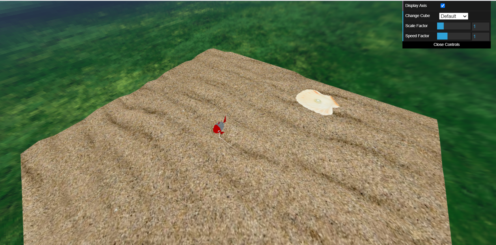
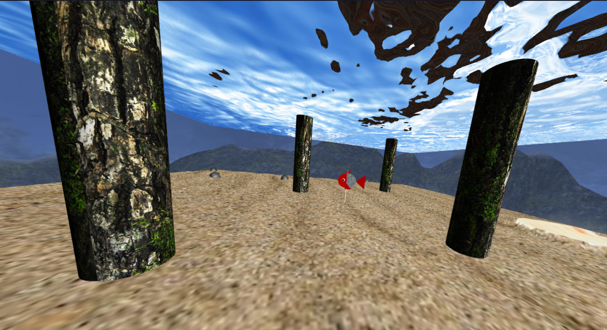

# CGRA 2020/2021

## Grupo T07G11
- João Mesquita - up201906682
- Rui Alves - up201905853

## Notas do Projeto

### Colocação de pedras no alvo (7.3) / Lançamento de pedras para o alvo (7.4)

1. Para o peixe pegar / largar as pedras, basta premir a tecla 'c'.
2. Apenas é possível agarrar em pedras quando o peixe se encontra no fundo.
3. Para largar
    - Caso esteja no ninho, é possível largar a pedra na posição deseja, quando o peixe se encontra no fundo.
    - Estando mais afastado, é possível atirar a pedra em direção ao ninho, quando o peixe se encontra no topo. Para além disso, as pedras são distribuidas no ninho em posições pseudo-aleatórias, sendo que empilham umas em cima das outras.

### MyAnimatedFish - Animação de outros peixes (7.5)

1. Adicionamos 2 peixes com animação independente à cena. Estes possuem posições aleatórias (simétricas) e velocidades diferentes.
2. Tal como o peixe principal, estes têm caudas e barbatanas animadas.

### Outros elementos (Algas)

1. Adicionamos algas à cena com um número de lados e dimensões aleatórias.
2. Incluímos uma verificação para não inserir algas dentro do ninho.

### Movimento do Peixe Principal

1. Com a utilização das teclas "WASD", o utilizador pode mexer o peixe ao longo do eixo Oxz.
2. Tecla 'L' -> Descer ao longo do eixo dos y.
   
   Tecla 'P' -> Subir ao longo do eixo dos y.

## Screenshots

Figura 1 - Animação do Peixe (1/2)

Figura 2 - Animação do Peixe (2/2)

========================================================

Figura 3 - Ninho do Peixe

========================================================

Figura 4 - Superfície da água

========================================================

Figura 5 - Pedras

========================================================

Figura 6 - MyPillar

========================================================

Figura 7 - Outros Elementos

========================================================

Figura 8 - Largar pedras no ninho (1/2)

========================================================

Figura 9 - Largar pedras no ninho (2/2)

========================================================

Figura 10 - Animação de outros peixes

========================================================

Figura 11 - Lançamento e colocação de pedras no alvo